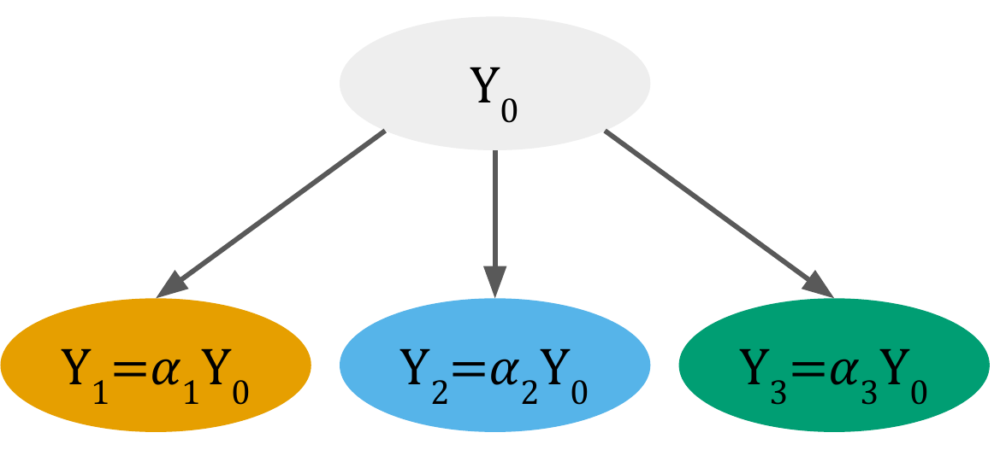
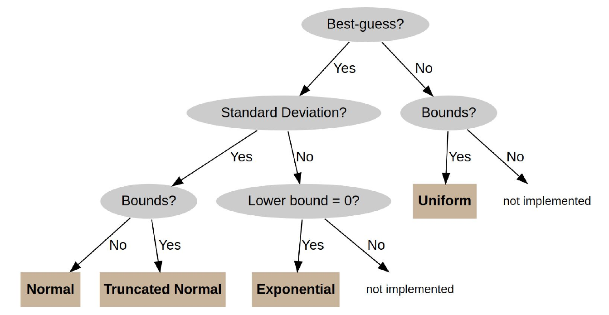
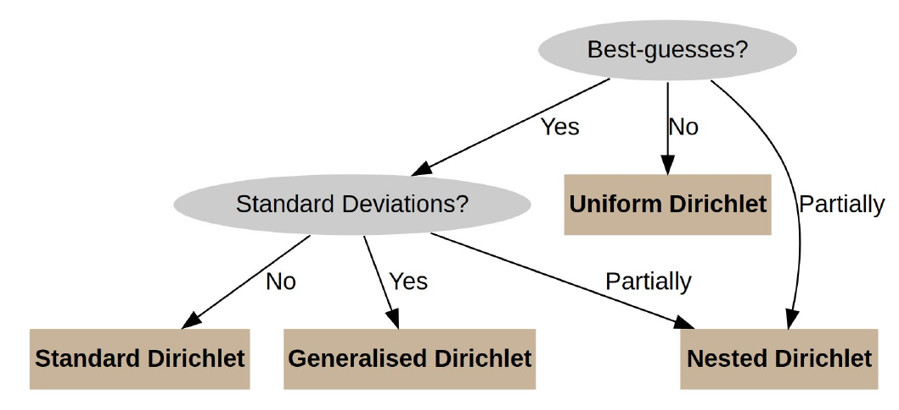

<!-- README.md is generated from README.Rmd. Please edit that file -->

```{r, include = FALSE}
knitr::opts_chunk$set(
  collapse = TRUE,
  comment = "#>",
  fig.path = "man/figures/README-",
  out.width = "100%"
)
```


## Installation

You can install the development version of disaggR from
[GitHub](https://github.com/) with:

``` r
# install.packages("devtools")
devtools::install_github("simschul/disaggR")
```


## Background: Uncertainty propagation involving data disaggregation

<!-- badges: start -->

<!-- badges: end -->

The goal of disaggR is an R-package that helps you with uncertainty
propagation when data disaggregation is involved. Data disaggregation
usually involves splitting one data point into several disaggregates
using proxy data. It is a common problem in many different research
disciplines.



Data disaggregation usually involves an aggregate flow $Y_0$, which is
known, such as the total amount of steel manufactured in a given time
and geography. What we do not know but are interested in are the $K$
disaggregate flows $Y_1,...,Y_K$, such as the different end-use sectors
where the manufactured steel ends up. Even though we do not know the
values of $Y_1, ..., Y_K$, our model structures commonly demands that
the individual $Y_i$'s need to sum to the known aggregate flow $Y_0$ to
respect the mass, energy, stoichiometric or economic balance of the
model

$$
  Y_0 = \sum_{i=1}^{K} Y_i 
$$

This equation, also called an *accounting identity* introduces
dependencies/correlations between the individual disaggregate flows
$Y_i$.

To get estimates for the disaggregate flows, one usually looks for proxy
data. Those proxy data are used to calculate shares (ratios/fractions)
of the respective disaggregate units $\alpha_1, ..., \alpha_K$. To
allocate the entire aggregate flow without leaving any residual (thus to
respect the system balance), those fractions need to sum to one:

$$    \sum_{i=1}^{K} \alpha_i = 1 $$

Disaggregate flows are calculated as

$$ y_i = \alpha_i y_0,  \forall i \in \{1,...,K\}.     $$

## Sampling disaggregates

This package generates a random sample of disaggregates based on the
information provided. The aggregate and the shares are sampled
independently. The distribution from which to sample is determined
internally based on the information provided by the user. This choice of
distribution is mostly based on the principle of Maximum Entropy
(MaxEnt).

The aggregate distribution is determined using the following decision
tree:



The shares are sampled from different variants of the Dirichlet
distribution:




## How to use

### Sampling disaggregates

The main function is `rdisagg` which creates a random sample of
disaggregates based on the information provided:

```{r}
library(disaggR)
sample <- rdisagg(n = 1000, mean_0 = 100, sd_0 = 5, min = 0, shares = c(0.1, 0.3, 0.6))
head(sample)
```

We can plot the marginal histograms of the sample: 

```{r}
hist(sample[,1])
hist(sample[,2])
hist(sample[,3])
```

The samples are consistent with all information provided. Thus, summing the disaggregate samples should provide an aggregate sample consistent with the information provided (mean: 100, sd: 5): 

```{r}
sample_agg <- rowSums(sample)
hist(sample_agg)
```

And indeed: 

```{r}
cat('Mean: ', mean(sample_agg), '\n')
cat('SD: ', sd(sample_agg))
```


### Sampling aggregates and shares seperatedely

With `disaggR` you can also sample the aggregate and the shares independently using the `ragg` and `rshares` functions: 

```{r}
sample_agg <- ragg(1000, mean = 100, sd = 5)
hist(sample_agg)
```

```{r}
sample_shares <- rshares(1000, shares = c(0.1, 0.3, 0.6))
boxplot(sample_shares)
```


